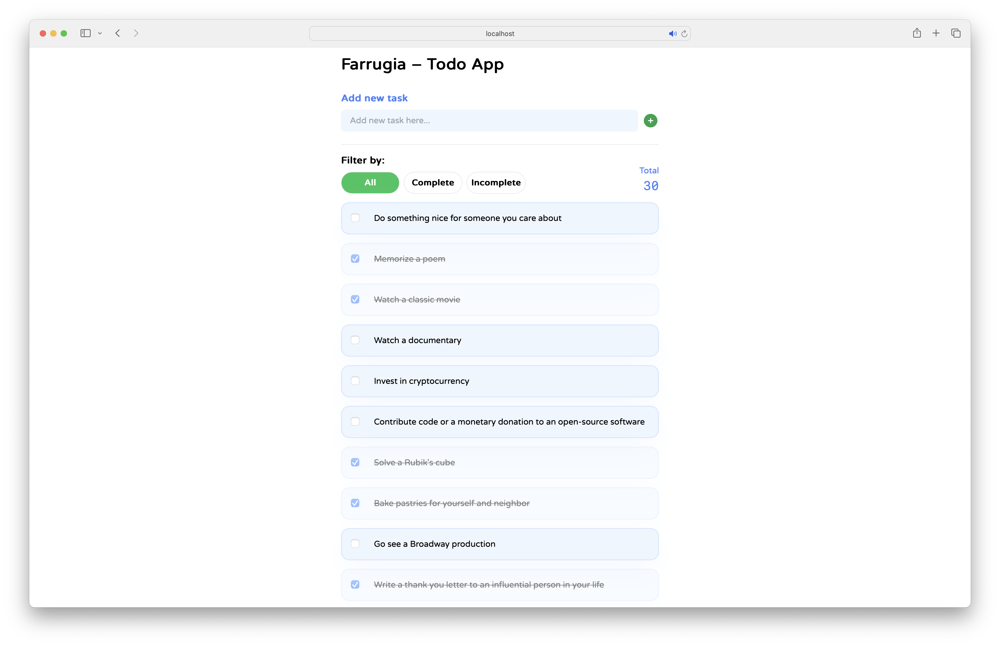

# Todo App



This is a simple Todo list app created with Vue 3, Typescript, Pinia and TailwindCSS. You can add, update and delete tasks. Furthermore, you can filter by the task's status.

The initial set of tasks is being called from [DummyJSON](https://dummyjson.com/docs/todos).

## Usage

### Add a task

You can add a task by inputting some text in the "Add new task" module on top and clicking the plus icon.

### Edit a task

You can select the text in the task and edit the task. You can update it by pressing enter on the keyboard. Furthermore, you can update it manually by clicking on the pencil icon on the right hand side of the task.

### Delete a task

You can delete a task by clicking the rubbish bin icon on the right hand side of the task.


### Caveat Notes:

1. Can not delete user added tasks due to limitation of DummyJSON
2. Newly user added tasks will get the same ID

### Future Updates

- [ ] Add animation effects
- [ ] Add Pinia Persist Storage

## Setup

```sh
npm install
```

### Compile and Hot-Reload for Development

```sh
npm run dev
```

### Type-Check, Compile and Minify for Production

```sh
npm run build
```

### Run Unit Tests with [Vitest](https://vitest.dev/)

```sh
npm run test:unit
```

### Lint with [ESLint](https://eslint.org/)

```sh
npm run lint
```
